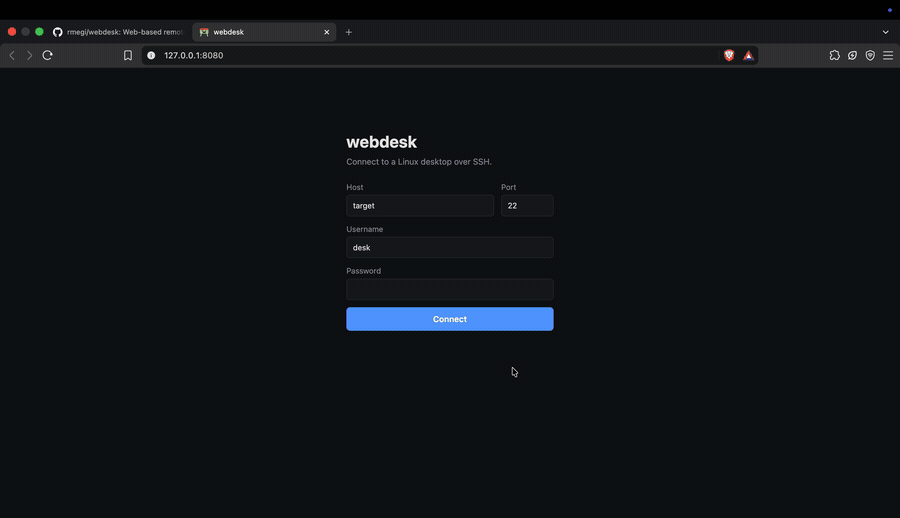

# webdesk

### If you can SSH to it, you can see it.



**A Linux desktop in your browser.** Type a machine's address and password like
you would for SSH, and its screen appears — mouse, keyboard and clipboard
working on it.

Nothing to install on the machine you're connecting to. No VNC server to set
up, no ports to forward.

```
Browser ──WebSocket──▶ webdesk ──SSH──▶ your Linux machine
   ▲                                          │
   └───────── WebRTC: video + input ──────────┘
```

## Try it

On Linux, one command installs whatever's missing (git, curl, Docker),
downloads webdesk into `~/webdesk` and starts it:

```sh
curl -fsSL https://raw.githubusercontent.com/rmegi/webdesk/main/install.sh | sh
```

It asks for your sudo password if it has to install anything. Run it again to
update. Add `| sh -s -- --with-target` instead of `| sh` to also start a test
machine to connect to. No `curl`? `wget -qO- <same URL> | sh` does the same.
You can [read the script](install.sh) first.

Already have Docker and a checkout:

```sh
docker compose up -d --build
```

Open <http://127.0.0.1:8080> and log in the way you would over SSH. That's the
whole setup — the web client, the server and the program that runs on the
target machine are all built inside the image.

## How it works

webdesk logs in over SSH and leaves a small Go binary in `~/.cache/webdesk/`.
That binary captures the X screen with ffmpeg, encodes H.264, and opens a
**WebRTC connection straight to your browser**.

The server only introduces the two sides. Once they're talking, video and input
go peer-to-peer and never touch it again.

Three things that make it feel quick:

- **The cursor is drawn locally.** It's kept out of the video and sent as a
  picture, so the pointer keeps up with your hand instead of trailing a round
  trip behind it.
- **Keys travel by position, not by letter**, so the machine's own keyboard
  layout stays in charge.
- **No desktop? It makes one.** A machine with no monitor gets a virtual X11
  desktop on Xvfb, which keeps running after you disconnect — **Log out** ends
  it.

## What the machine needs

Linux on x86_64 or arm64, reachable over SSH, with `ffmpeg`. A virtual desktop
also wants `Xvfb`, `dbus-launch` and one of LXDE, XFCE, MATE, LXQt, Openbox or
GNOME. On Debian and Ubuntu, webdesk offers to install whatever is missing from
the page, once you confirm.

## Before you expose it

**The page has no login of its own yet.** Anyone who can reach it can use your
server to attempt SSH logins — and with the password left blank it will try
the server's own configured key against whatever hostname they type. So it
binds to `127.0.0.1`, and you should leave it there.

To reach it from elsewhere, put the network in front of it rather than opening
the port: a Tailscale address, an SSH tunnel (`ssh -L 8080:127.0.0.1:8080 …`),
or a reverse proxy that does its own authentication. Setting `HOST=0.0.0.0` on
a network you don't control hands an SSH proxy to everyone on it.

Host keys are pinned on first connect and a change is refused. Passwords are
used for the SSH login and nothing else — never logged, never stored, and the
browser remembers only host, port and username.

<details>
<summary><b>Running from source</b></summary>

Needs Python 3.11+, Node 24+ and Go 1.27. Node is build tooling only — the web
client is compiled with `tsc` and nothing uses it at runtime.

```sh
npm install
pip install -r backend/requirements.txt
npm run dev     # http://127.0.0.1:8080
```

There's no nginx this way, so the server hands out the page itself.

```
frontend/  Browser client (TypeScript) + its nginx image
backend/   Python server: SSH login, signaling relay
host/      Go program that runs on the target: capture, WebRTC, input
test/      Docker test machine: SSH server + XFCE on a virtual screen
```

| Script | What it does |
| --- | --- |
| `npm run dev` | Build everything, run the server with auto-reload |
| `npm run docker` | Build and start the app in Docker |
| `npm run docker:down` | Stop every container, test machine included |
| `npm run test:target` | Build and start the Docker test machine |
| `npm run build` | Build the web client and host binaries (amd64 + arm64) |
| `npm run typecheck` | Type-check the web client |

Build the images on each machine you run them on and they take that machine's
architecture. The host binaries are cross-compiled for both either way, since
the machines being controlled aren't the machine running the server.

CI type-checks the web client, imports the server, runs `gofmt` and `go vet`,
and builds everything including the images.

### Test machine

A container with an SSH server and a logged-in XFCE desktop, so there's
something to connect to without a spare Linux box:

```sh
npm run test:target
```

Connect to `127.0.0.1` port `2222`, user `desk`, password `desk`. An empty
password uses the test key in `test/ssh/`. From a server that is itself in
Docker, use host `target` port `22` instead.

</details>

<details>
<summary><b>Configuration</b></summary>

Server:

| Variable | Default | Purpose |
| --- | --- | --- |
| `PORT` | `8080` | HTTP port |
| `HOST` | `127.0.0.1` | Listen address — see above before changing |
| `WEBDESK_ICE_SERVERS` | Google STUN | JSON array of `RTCIceServer`, e.g. to add a TURN relay |
| `WEBDESK_SSH_KEY` | none | Comma-separated key paths tried when the password is empty |

Host program, read from the SSH session's environment:

| Variable | Default | Purpose |
| --- | --- | --- |
| `WEBDESK_FPS` | `30` | Capture frame rate |
| `WEBDESK_VIRTUAL_SIZE` | `1920x1080` | Size of a virtual desktop |
| `WEBDESK_ICE_PORT` | random | Pin WebRTC to one UDP+TCP port |
| `WEBDESK_ICE_HOST_IP` | none | Advertise this IP instead of local ones |

Video and input go peer-to-peer, so your browser has to reach the target
machine directly. Both on the same tailnet or LAN is fine; browsing from
somewhere that can't route to it needs a TURN relay in `WEBDESK_ICE_SERVERS`.

Pinned host keys live in `backend/data/known_hosts.json`, kept in a named
volume under Docker. `docker compose down -v` forgets them.

</details>
